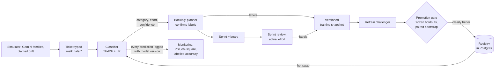
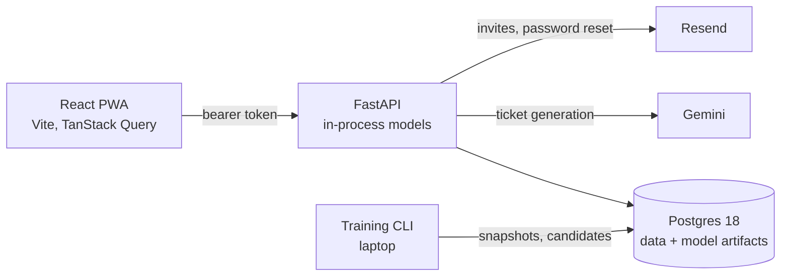

# Family Kanban (Gezinsbord)

A household kanban app with a **machine-learning model that is trained, versioned,
monitored for drift and retrained**. My family uses it for real: tasks go in, a classifier
predicts their category and effort, we plan weekly sprints, and the sprint review tells the
model how big each task *really* was. A simulator runs the whole app for LLM-generated
families, so the full ML lifecycle can be demonstrated with drift planted at a known week.

Built as a portfolio project to learn **classical ML and MLOps** from first principles. Every
ML step has a written lesson in [docs/learning/](docs/learning/), including the experiments
that failed.

**Live**: [the app](https://ideal-achievement-production-6b63.up.railway.app) (Dutch UI, PWA) ·
API on Railway · ~140 backend tests

## The ML lifecycle in this repo



| Stage | What's built | Where |
|---|---|---|
| Data | Gemini-generated Dutch tickets with weak labels; real family data kept separate by a `source` column on every row | `sim/`, `ml/datasets.py` |
| Models | TF-IDF (word + char n-grams) + logistic regression; ordinal model for effort (S < M < L); temperature-scaled confidence | `ml/models.py`, `ml/calibration.py` |
| Evaluation | Frozen holdouts split *by household*, near-duplicate exclusion, macro-F1 with bootstrap CIs, per-category and per-source reports | `ml/holdout.py`, `ml/evaluate.py` |
| Versioning | Registry with artifacts in Postgres, data hashes, snapshots; every prediction carries its `model_version_id` | `ml/registry.py` |
| Promotion | Champion vs challenger on every frozen holdout; paired bootstrap; promote only if clearly better on today's world and not clearly worse elsewhere; one-command rollback | `ml/train.py`, `ml/retrain.py` |
| Monitoring | PSI and chi-square on inputs/predictions, Wilson intervals on labelled accuracy, onset-based alarms, per-category segments | `ml/monitoring.py`, admin dashboard |
| Simulation | World model with seasons and scenario events (a dog arrives, groceries start taking longer, a child starts typing); deterministic replays; shadow evaluation of candidate models | `sim/` |
| Adaptation | Per-household label-shift correction from the family's own recent reviews | `ml/adaptation.py` |
| Retrieval | "Done before": similar earlier tasks of the family when planning | `ml/retrieval.py` |
| Planner Assistant | Gemini (or rules) proposes a draft sprint; names masked, output validated, evaluated in simulation | `app/services/planner_assistant.py`, `sim/compare_planners.py` |

## What the experiments showed

The honest results are the interesting part. Each one has a lesson with the full numbers.

- **The classifier works on simulated data.** Holdout macro-F1 is 0.93 for category and 0.71
  for effort; the majority baseline scores 0.05 and 0.30. [Lesson 03](docs/learning/03-versioning-serving-and-promotion.md)
- **Concept drift is invisible without labels.** When groceries started taking longer, effort
  accuracy fell from 0.69 to 0.49 while the model's confidence stayed at 0.94. Only the sprint
  review reveals it. [Lesson 04](docs/learning/04-simulation-and-drift.md)
- **A control run caught a false discovery.** The detector flagged "a dog arrived" in the right
  week. A baseline run *without* a dog alarmed in the same week: it was the September school
  start. Then the real concept-drift detection didn't replicate in a second world. One run proves
  little. [Lesson 05](docs/learning/05-monitoring-and-drift-detection.md)
- **Retraining fixed the overall score, but not the drifted category.** effort-v2 passed the gate
  (+0.14 macro-F1 on the new world, 95% CI +0.07 to +0.22) and was promoted. Groceries stayed at
  0.18: a global model can't know *which* family moved. A per-household adjustment lifted
  groceries to 0.33 in a shadow replay. [Lesson 06](docs/learning/06-retraining.md)
- **The plan said embeddings + pgvector, and the measurements said TF-IDF.** On this data a
  multilingual sentence embedding lost on every test: retrieval precision@3 was 0.61 vs 0.67, and
  as classifier features 0.87 vs 0.94 (category) and 0.53 vs 0.63 (effort). It was trained to
  ignore exactly the difference that effort depends on. Production serves TF-IDF; the embedding
  code stays as a documented experiment. [Lesson 07](docs/learning/07-embeddings.md)
- **An LLM planner finishes more work, by overloading people.** The Planner Assistant (Gemini)
  was compared with a transparent rule baseline in simulated families with a time budget per
  person. Gemini finished +2 to +4 hours of work a week but planned 2.5× as much, and a clearly
  smaller share got done; the rules under-planned, stuck in a feedback loop. Neither wins by the
  rule declared in advance, so the proposal stays a suggestion the planner trims.
  [Lesson 08](docs/learning/08-llm-planner.md)

## Architecture



- **Backend**: FastAPI, SQLAlchemy 2 (async), Alembic, fastapi-users (email/password, Google
  OAuth ready). scikit-learn, pandas.
- **Frontend**: React 19, TypeScript, Tailwind, dnd-kit (board), Recharts (dashboard),
  installable PWA. Dutch UI; code and docs in English.
- **Hosting**: Railway (API and frontend as Docker services, Postgres). Migrations run on deploy.
- **Multi-tenant** from day one: every table is scoped by household, and cross-household access
  returns 404 (tested for every endpoint).

### Deliberately lightweight

At household scale (a few model versions a month, one developer) these are choices, not
shortcuts:

| Here | At company scale |
|---|---|
| Registry = a Postgres table + artifacts ([ADR-002](docs/decisions/002-model-registry.md)) | MLflow model registry; the statuses map 1:1 to aliases |
| Retraining via a CLI with a promotion gate | A scheduled pipeline (Airflow, Prefect) running the same steps |
| Drift checks computed when the dashboard loads | A monitoring job writing to a time-series store, with alerting |
| Models served in-process with a cache | A separate model server once models get large or many |
| Snapshots as Parquet files with a hash | A feature store / data versioning tool |

## Run it locally

```bash
cp .env.example .env
docker compose up -d                                   # Postgres 18 + pgvector on :5433
cd backend && uv sync && uv run alembic upgrade head
uv run uvicorn app.main:app --reload                   # API on :8000
cd ../frontend && npm install && npm run dev           # app on :5173
```

Tests: `cd backend && uv run pytest` (builds a test database from the real migrations).
ML commands (training, retraining, holdouts, simulations, retrieval evaluation) are listed in
[CLAUDE.md](CLAUDE.md).

## Documents

- [docs/PRD.md](docs/PRD.md): product spec and skill coverage map
- [docs/PLAN.md](docs/PLAN.md): the phased plan, with outcomes per phase
- [docs/learning/](docs/learning/): eight ML lessons, from weak labels to an LLM planner
- [docs/decisions/](docs/decisions/): architecture decision records
- [docs/interview-walkthrough.md](docs/interview-walkthrough.md): a 10-minute guided tour
- [docs/deploy.md](docs/deploy.md): Railway deployment

Built with [Claude Code](https://claude.com/claude-code) as a pair programmer and teacher; the
project's agent, skill and hook setup lives in [.claude/](.claude/).
